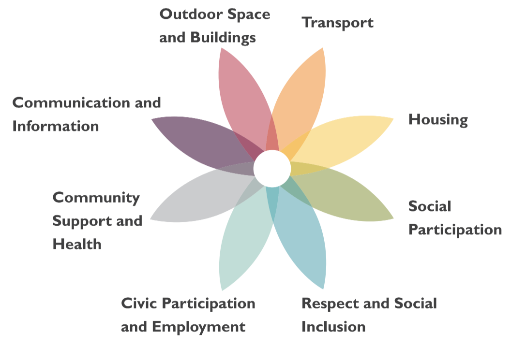

### What is an Age Friendly City?

**The World Health Organisation (WHO) Age-Friendly Cities programme is a global movement aiming to improve the experiences of older people living in cities around the world.**

The WHO AFCC approach focuses on features of a city’s structures, environment, services and policies that impact on older residents’ experience of ageing. The features which impact on ‘Age- friendliness’ are presented in eight ‘domains’ as petals of a flower, at the centre of which an individual experiences the city as more (or less) Age-friendly (WHO 2007: Fig 6).

Since each domain encompasses a wide range of factors, the WHO flower indicates that each of these ‘determinants’ can be variously and simultaneously involved in making the city more or less Age-friendly. In a similar vein, the WHO concept of Active-ageing suggests that the potential of Age-friendliness is defined by the ability of older people to individually and collectively infl uence or control the impact on their experience of the city of some or all of the factors across the domains of the Age-friendly flower.

